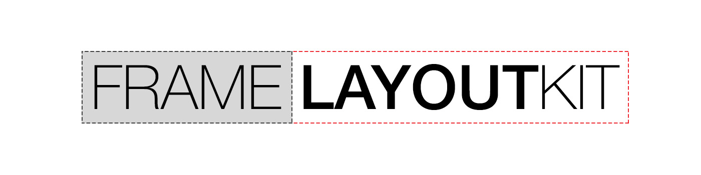
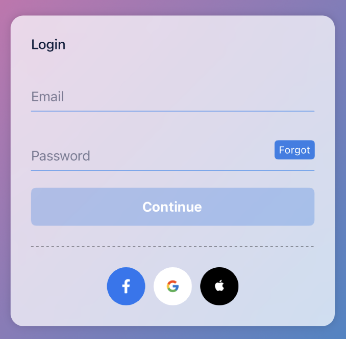
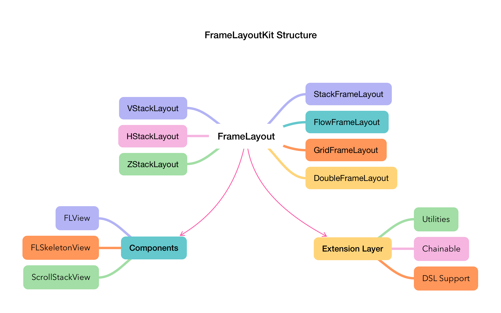

# FrameLayoutKit

[](http://cocoapods.org/pods/FrameLayoutKit)
[](https://developer.apple.com/swift)
[](http://cocoapods.org/pods/FrameLayoutKit)
[](https://github.com/apple/swift-package-manager)
[](http://cocoapods.org/pods/FrameLayoutKit)



A super fast and easy-to-use layout library for iOS. FrameLayoutKit supports complex layouts, including chaining and nesting layout with simple and intuitive operand syntax.

It simplifies the UI creation process, resulting in cleaner and more maintainable code.


## Why?

Say NO to autolayout constraint nightmare:

<table>
<tr><td> Autolayout </td> <td> FrameLayoutKit </td></tr>
<tr>
<td>

</td>
<td>

</td>
</tr>
</table>


# Installation

FrameLayoutKit is available through `Swift Package Manager` (Recommended) and [CocoaPods](http://cocoapods.org):

Regardless, make sure to import the project wherever you may use it:

```swift
import FrameLayoutKit
```

### Cocoapods:
FrameLayoutKit can be installed as a [CocoaPod](https://cocoapods.org/). To install, include this in your Podfile.

```ruby
pod "FrameLayoutKit"
```


### Swift Package Manager
[Swift Package Manager](https://swift.org/package-manager/) is recommended to install FrameLayoutKit.

 1. Click `File`
 2. `Add Packages...`
 3. Specify the git URL for FrameLayoutKit.

```swift
https://github.com/kennic/FrameLayoutKit.git
```

# Example
Some examples of how FrameLayoutKit works:

<table>
<tr><td> Source </td> <td> Result </td></tr>
<tr>
<td>
	
```swift
let frameLayout = HStackLayout()
frameLayout + VStackLayout {
   ($0 + earthImageView).alignment = (.top, .center)
   ($0 + 0).flexible() // add a flexible space
   ($0 + rocketImageView).alignment = (.center, .center)
}
frameLayout + VStackLayout {
   $0 + [nameLabel, dateLabel] // add an array of views
   $0 + 10 // add a space with a minimum of 10 pixels
   $0 + messageLabel // add a single view
}.spacing(5.0)

frameLayout
   .spacing(15)
   .padding(top: 15, left: 15, bottom: 15, right: 15)
   .debug(true) // show dashed lines to visualize the layout
```
</td>
<td>

</td>
</tr>
</table>

<table>
<tr><td> Source </td> <td> Result </td></tr>
<tr>
<td>

```swift
let frameLayout = VStackLayout {
  ($0 + imageView).flexible()
  $0 + VStackLayout {
     $0 + titleLabel
     $0 + ratingLabel
  }
}.padding(top: 12, left: 12, bottom: 12, right: 12)
 .distribution(.bottom)
 .spacing(5)
```
</td>
<td>

</td>
</tr>
</table>

<table>
<tr><td> Source </td> <td> Result </td></tr>
<tr>
<td>

```swift
let posterSize = CGSize(width: 100, height: 150)
let frameLayout = ZStackLayout()
frameLayout + backdropImageView
frameLayout + VStackLayout {
 $0 + HStackLayout {
  ($0 + posterImageView).fixedSize(posterSize)
    $0 + VStackLayout {
      $0 + titleLabel
      $0 + subtitleLabel
    }.padding(bottom: 5).flexible().distribution(.bottom)
  }.spacing(12).padding(top: 0, left: 12, bottom: 12, right: 12)
}.distribution(.bottom)
```
</td>
<td>

</td>
</tr>
</table>

<table>
<tr><td> Source </td> <td> Result </td></tr>
<tr>
<td>

```swift
let buttonSize = CGSize(width: 45, height: 45)
let cardView = VStackLayout()
  .spacing(10)
  .padding(top: 24, left: 24, bottom: 24, right: 24)

cardView + titleLabel
(cardView + emailField).minHeight = 50
(cardView + passwordField).minHeight = 50
(cardView + nextButton).fixedHeight = 45
(cardView + separateLine)
  .fixedContentHeight(1)
  .padding(top: 4, left: 0, bottom: 4, right: 40)
cardView + HStackLayout {
 ($0 + [facebookButton, googleButton, appleButton])
  .forEach { $0.fixedContentSize(buttonSize) }
}.distribution(.center).spacing(10)
```
</td>
<td>

</td>
</tr>
</table>

Two types of code syntax:

<table>
<tr><td>Regular syntax</td> <td>Chained syntax</td></tr>
<tr>
<td>

```swift
frameLayout.distribution = .center
frameLayout.spacing = 16
frameLayout.isFlexible = true
```
</td>
<td>
	
```swift
frameLayout
  .distribution(.center)
  .spacing(16)
  .flexible()
```
</td>
</tr>
</table>

## DSL Syntax

In `FrameLayoutKit`, DSL (Domain Specific Language) syntax provides a more declarative and readable way to define layouts, much like SwiftUI. This syntax is particularly used in `VStackView`, `HStackView`, and `ZStackView`. These views support DSL, allowing you to add standard UIKit views directly or customize them with `Item(view)` for more control over size and position. It simplifies the process of creating and managing layouts by offering a SwiftUI-like declarative approach, making your code more readable and easier to maintain.

```swift
let titleLabel = UILabel()
let descriptionLabel = UILabel()
let actionButton = UIButton()

let vStackLayout = VStackView {
    titleLabel
    descriptionLabel
    SpaceItem(20) // Adds a space of 20 points
    Item(actionButton).minWidth(120) // Customizes the button's minimum width
}

```

## Overall Structure



# Benchmark
FrameLayoutKit is one of the fastest layout libraries.


See: [Layout libraries benchmark's project](https://github.com/layoutBox/LayoutFrameworkBenchmark)

# Todo

- [x] Swift Package Manager
- [x] CocoaPods support
- [x] Objective-C version (Deprecated - Not recommended)
- [x] Swift version
- [x] Examples
- [ ] Documents

# Author

Nam Kennic, namkennic@me.com

# License

FrameLayoutKit is available under the MIT license. See the LICENSE file for more info.
