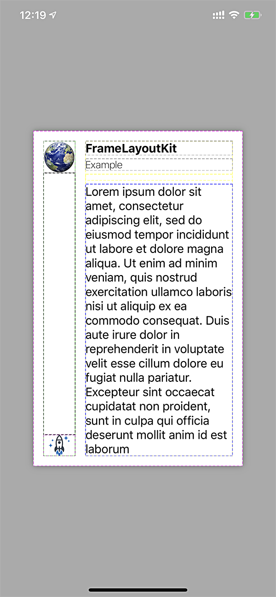

# FrameLayoutKit

[](http://cocoapods.org/pods/FrameLayoutKit)
[](https://developer.apple.com/swift)
[](http://cocoapods.org/pods/FrameLayoutKit)
[](https://github.com/apple/swift-package-manager)
[](http://cocoapods.org/pods/FrameLayoutKit)


FrameLayout is a super fast and easy to use layout library for iOS and tvOS.

For Objective-C version: [NKFrameLayoutKit](http://github.com/kennic/NKFrameLayoutKit) (Deprecated, not recommended)

## Why?

Say NO to autolayout constraint nightmare:


FrameLayoutKit supports complex layouts, including chaining and nesting layout with simple and intuitive operand syntax.

## Example

To run the example project, clone the repo, and run `pod install` from the Example directory first.

## Installation

FrameLayoutKit is available through `Swift Package Manager` (Recommended) and [CocoaPods](http://cocoapods.org):

Regardless, make sure to import the project wherever you may use it:

```swift
import FrameLayoutKit
```

### Cocoapods:
FrameLayoutKit can be installed as a [CocoaPod](https://cocoapods.org/). To install, include this in your Podfile.

```ruby
pod "FrameLayoutKit"
```


### Swift Package Manager
The [Swift Package Manager](https://swift.org/package-manager/) is a tool for automating the distribution of Swift code and is integrated into Xcode and the Swift compiler. **This is the recommended installation method.** Updates to FrameLayoutKit will always be available immediately to projects with SPM. SPM is also integrated directly with Xcode.

If you are using Xcode 11 or later:
 1. Click `File`
 2. `Add Packages...`
 3. Specify the git URL for FrameLayoutKit.

```swift
https://github.com/kennic/FrameLayoutKit.git
```

## Example
Some examples of how FrameLayoutKit works:

<table>
<tr><td> Source </td> <td> Result </td></tr>
<tr>
<td>
	
```swift
let frameLayout = HStackLayout()
frameLayout + VStackLayout {
   ($0 + earthImageView).alignment = (.top, .center)
   ($0 + 0).flexible() // add a flexible space
   ($0 + rocketImageView).alignment = (.center, .center)
}
frameLayout + VStackLayout {
   $0 + [nameLabel, dateLabel] // add an array of views
   $0 + 10 // add space with 10 px fixed
   $0 + messageLabel // add a single view
   $0.spacing = 5.0 // spacing between views
}

frameLayout
   .spacing(15)
   .padding(top: 15, left: 15, bottom: 15, right: 15)
   .debug(true)
```
</td>
<td>

</td>
</tr>
</table>

<table>
<tr><td> Source </td> <td> Result </td></tr>
<tr>
<td>

```swift
(frameLayout + imageView).flexible()
frameLayout + VStackLayout {
 $0 + titleLabel
 $0 + ratingLabel
}
		
frameLayout
 .padding(top: 12, left: 12, bottom: 12, right: 12)
 .distribution(.bottom)
 .spacing(5)
```
</td>
<td>

</td>
</tr>
</table>

<table>
<tr><td> Source </td> <td> Result </td></tr>
<tr>
<td>

```swift
let posterSize = CGSize(width: 100, height: 150)
let frameLayout = ZStackLayout()
frameLayout + backdropImageView
frameLayout + VStackLayout {
 $0 + HStackLayout {
  ($0 + posterImageView).fixedSize(posterSize)
    $0 + VStackLayout {
      $0 + titleLabel
      $0 + subtitleLabel
    }.padding(bottom: 5).flexible().distribution(.bottom)
  }.spacing(12).padding(top: 0, left: 12, bottom: 12, right: 12)
			
  $0.distribution(.bottom)
}
```
</td>
<td>

</td>
</tr>
</table>

## Benchmark
FrameLayoutKit is one of the fastest layout libraries.


See: [Layout libraries benchmark's project](https://github.com/layoutBox/LayoutFrameworkBenchmark)

## Todo

- [x] Swift Package Manager
- [x] CocoaPods support
- [x] Objective-C version (Deprecated - Not recommended)
- [x] Swift version
- [x] Examples
- [ ] Documents

## Author

Nam Kennic, namkennic@me.com

## License

FrameLayoutKit is available under the MIT license. See the LICENSE file for more info.
